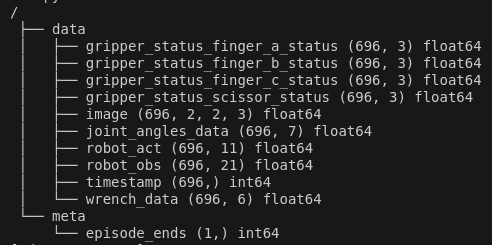
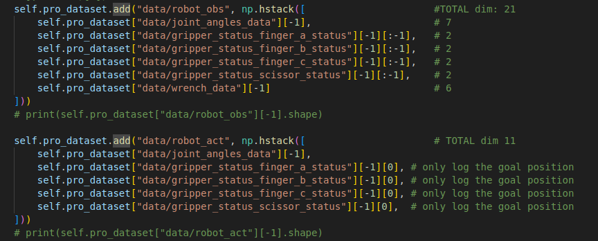

# Dataset format
Example:



### data
**data** group contains all the required data for training. Each array within it must have the same # of timesteps, with the shape (# timesteps, ...)

NOTE: in our model we only use **robot_act**, **robot_obs** and **image**:
- **robot_obs** - [7 joint angles, [position_request, position] * finger_{a,b,c} and scissor_status, wrench force, wrench torque]
- **image** - 300x486 image for the image configuration (resolution can be changed in the config)
- **robot_act** - [7 joint angles, position_request * finger{a,b,c} and scissor_status]



### meta
**meta** group contains the episode_ends array which stores what index each demonstration/episode/trajectory ended on (so in the above example it stores [696])

# Train Commands
- Images config: ``` python train.py --config-dir=. --config-name=victor_diffusion_policy.yaml training.seed=7 training.device=cuda:0 hydra.run.dir='data/outputs/${now:%Y.%m.%d}/${now:%H.%M.%S}_${name}_${task_name}'```
- State-only config: ```python train.py --config-dir=. --config-name=victor_diffusion_policy_state.yaml training.seed=7 training.device=cuda:0 hydra.run.dir='data/outputs/${now:%Y.%m.%d}/${now:%H.%M.%S}_${name}_${task_name}'```

# Testing
Currently there is no robust testing pipeline, instead use victor_test.py to compare the model's inference against the input it was trained on

